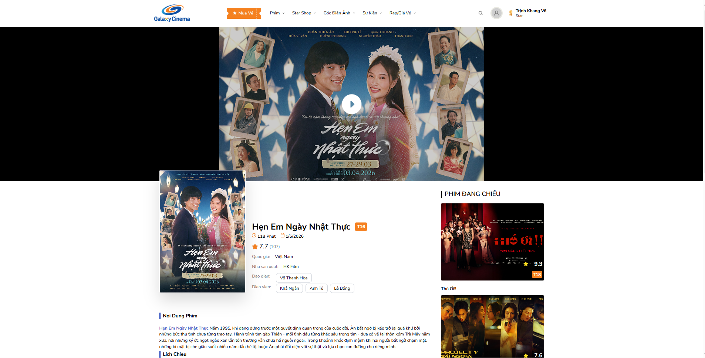
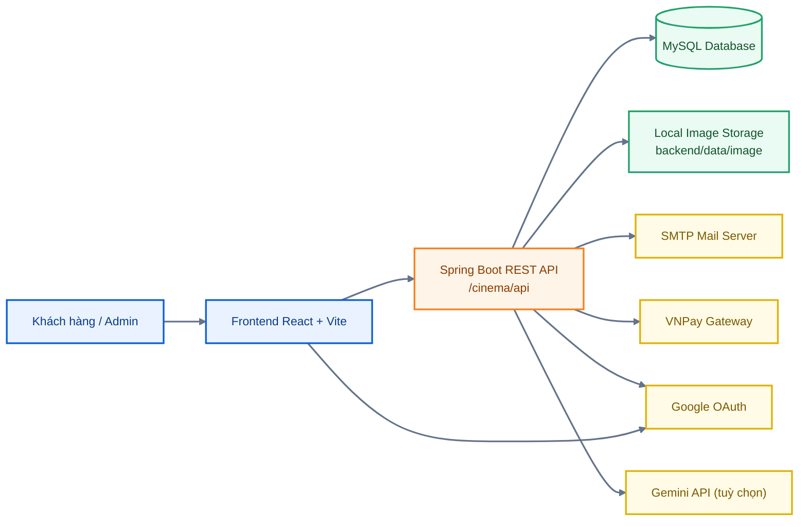
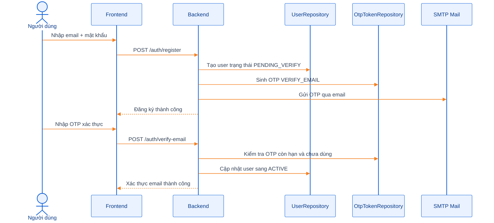
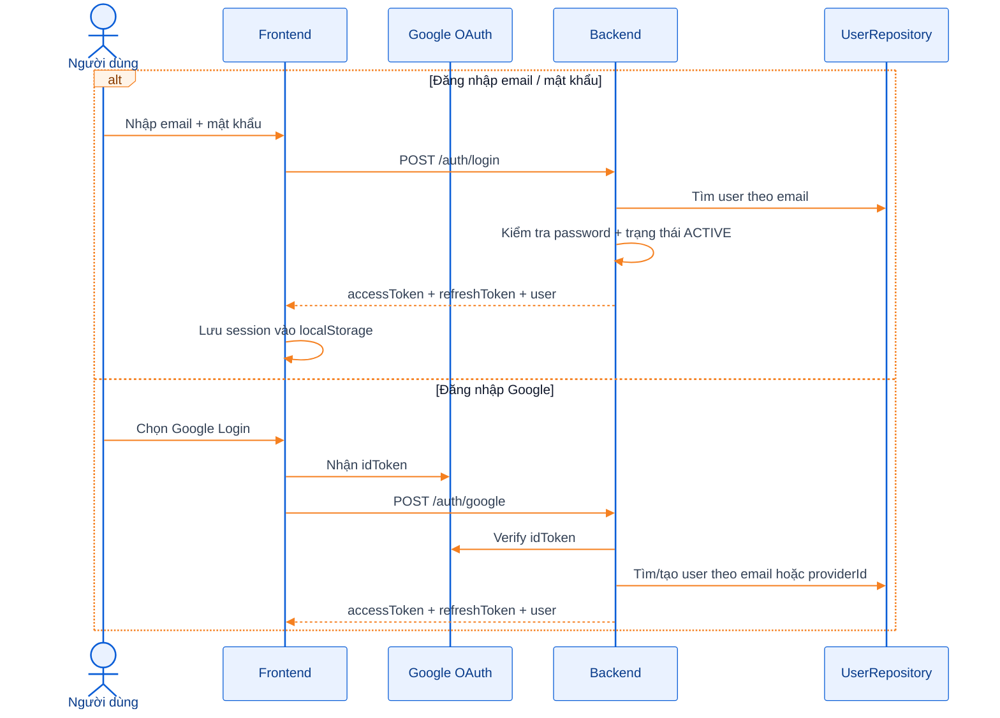
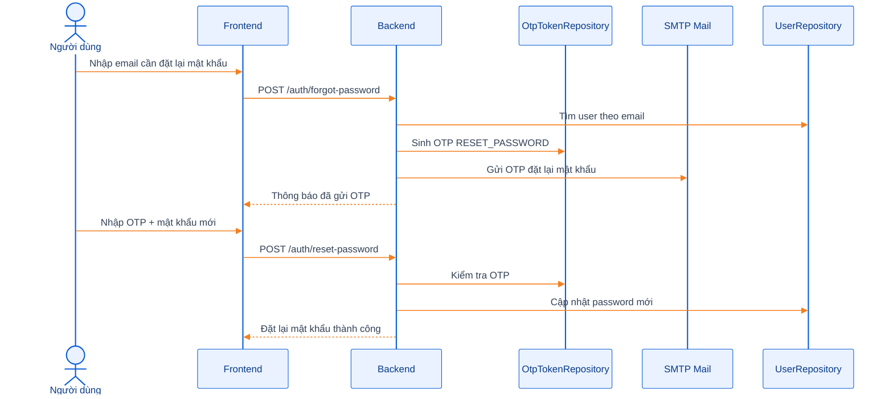
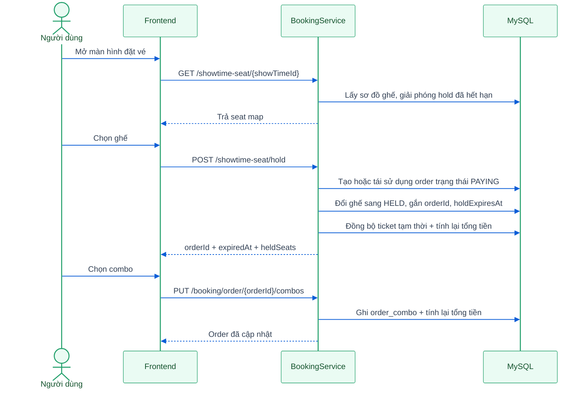
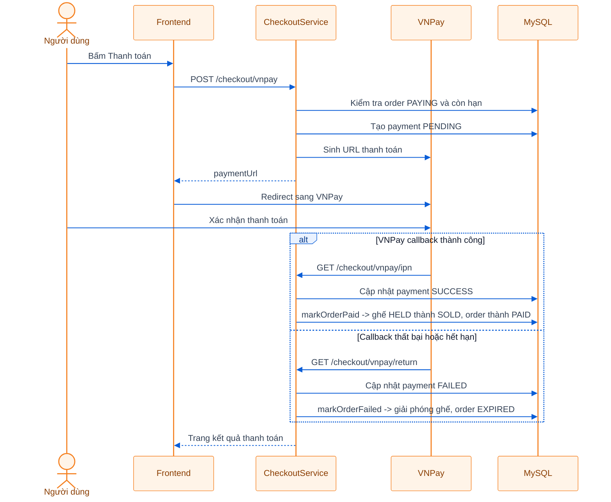
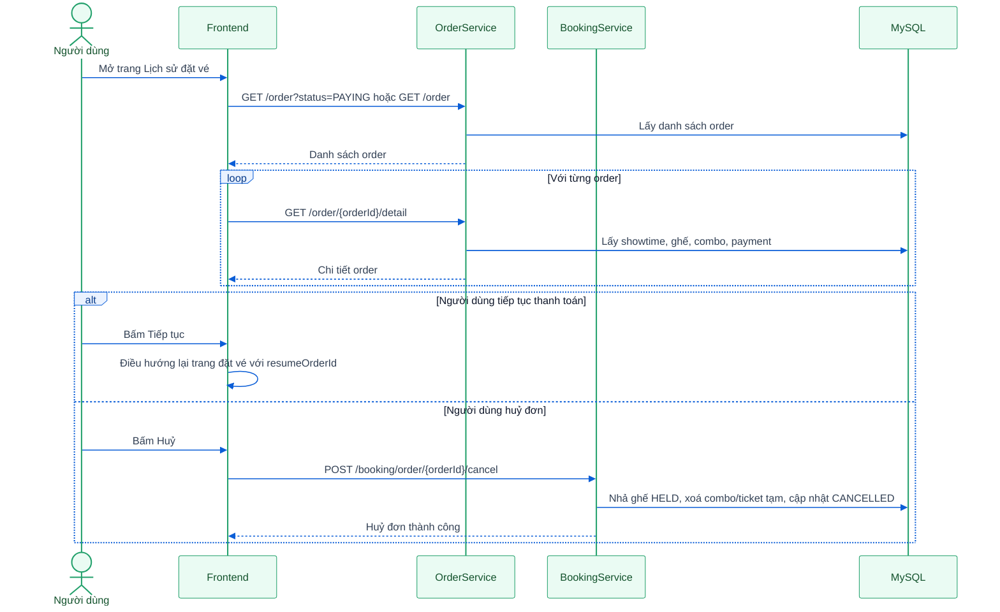

# Cinema Booking System

<p align="center">
  
</p>

<p align="center">
  Hệ thống đặt vé xem phim trực tuyến gồm khu vực khách hàng và khu vực quản trị, được xây dựng theo kiến trúc
  <strong>React + Spring Boot + MySQL</strong>, hỗ trợ xác thực email bằng OTP, đăng nhập Google, giữ ghế tạm thời,
  thanh toán VNPay, quản lý đơn hàng, quản lý phim, rạp, phòng, ghế, suất chiếu và combo.
</p>

<p align="center">
  
  
</p>

## Mục lục

- [1. Giới thiệu về project](#1-giới-thiệu-về-project)
- [2. Công nghệ sử dụng](#2-công-nghệ-sử-dụng)
- [3. Kiến trúc project](#3-kiến-trúc-project)
- [4. Sơ đồ chức năng](#4-sơ-đồ-chức-năng)
- [5. Cấu trúc thư mục](#5-cấu-trúc-thư-mục)
- [6. Hướng dẫn cài đặt và chạy project](#6-hướng-dẫn-cài-đặt-và-chạy-project)
- [7. Tài khoản mẫu và dữ liệu demo](#7-tài-khoản-mẫu-và-dữ-liệu-demo)
- [8. Hướng dẫn sử dụng các chức năng](#8-hướng-dẫn-sử-dụng-các-chức-năng)
- [9. Sequence diagram cho các chức năng chính](#9-sequence-diagram-cho-các-chức-năng-chính)
- [10. Hình ảnh minh hoạ](#10-hình-ảnh-minh-hoạ)
- [11. API và tài nguyên hữu ích](#11-api-và-tài-nguyên-hữu-ích)
- [12. Hướng dẫn đóng góp](#12-hướng-dẫn-đóng-góp)
- [13. License](#13-license)

## 0. Video demo tổng quan

<video src="https://drive.google.com/file/d/17mjifx1C0SN6hnJeCvt21EVWhAYWj4Ib/view?usp=sharing" controls width="100%"></video>

Nếu GitHub không hiển thị video trực tiếp, có thể mở tại: [https://drive.google.com/file/d/17mjifx1C0SN6hnJeCvt21EVWhAYWj4Ib/view?usp=sharing](https://drive.google.com/file/d/17mjifx1C0SN6hnJeCvt21EVWhAYWj4Ib/view?usp=sharing)

## 1. Giới thiệu về project

`Cinema Booking System` là một project full-stack mô phỏng quy trình đặt vé rạp chiếu phim khá đầy đủ, từ khâu khám phá phim cho tới thanh toán và quản trị vận hành. Ở góc độ nghiệp vụ, hệ thống tập trung vào 2 nhóm người dùng chính:

- `Khách hàng`: xem phim đang chiếu/sắp chiếu, lọc lịch chiếu theo tỉnh thành và ngày, đăng ký/đăng nhập, chọn ghế, chọn combo, thanh toán VNPay, xem lại lịch sử đơn hàng và cập nhật tài khoản.
- `Quản trị viên`: quản lý dữ liệu nền của hệ thống như người dùng, tỉnh/thành, rạp, phòng, loại ghế, giá vé, combo, phim, suất chiếu và đơn hàng.

### Điểm nổi bật của project

- Xác thực tài khoản bằng `email + mật khẩu`, có `OTP xác thực email`.
- Hỗ trợ `đăng nhập Google`.
- Hỗ trợ `quên mật khẩu` bằng OTP qua email.
- Hỗ trợ `đổi email`, `đổi mật khẩu`, `cập nhật hồ sơ cá nhân`.
- Có luồng `đặt vé nhanh`, `xem chi tiết lịch chiếu`, `tìm suất chiếu`.
- Có cơ chế `giữ ghế tạm thời` trước khi thanh toán.
- Tự động đồng bộ `ticket`, `order`, `payment` trong lúc giữ ghế và thanh toán.
- Thanh toán qua `VNPay`, có xử lý `return callback` và `IPN`.
- Có `Swagger/OpenAPI` để test API.
- Backend còn có thêm cụm API `Gemini` để kiểm tra tích hợp AI ở mức service.

### Những gì đang có trong codebase

#### Chức năng phía khách hàng

- Trang chủ hiển thị banner, phim đang chiếu, phim sắp chiếu.
- Trang danh sách phim theo suất chiếu (`/phim-dang-chieu`).
- Trang tìm suất chiếu theo `tên phim + tỉnh/thành + ngày`.
- Trang chi tiết lịch chiếu theo phim, lọc theo khu vực và ngày.
- Luồng đặt vé nhanh (`/dat-ve-quick`).
- Đăng ký, xác thực email, đăng nhập, Google login, quên mật khẩu.
- Chọn ghế với 3 loại ghế: thường, VIP, ghế đôi.
- Chọn combo và tạo giao dịch thanh toán.
- Trang trả kết quả thanh toán VNPay.
- Lịch sử đặt vé: xem tất cả đơn, lọc đơn đang chờ thanh toán, huỷ đơn, tiếp tục thanh toán.
- Trang tài khoản: cập nhật hồ sơ, đổi mật khẩu, đổi email, đăng xuất.

#### Chức năng phía quản trị

- Dashboard tổng quan giao diện quản trị.
- Quản lý người dùng.
- Quản lý tỉnh/thành.
- Quản lý rạp.
- Quản lý loại phòng.
- Quản lý phòng.
- Quản lý ghế thông qua modal quản lý ghế trong trang phòng.
- Quản lý loại ghế.
- Quản lý giá vé.
- Quản lý combo có upload ảnh.
- Quản lý phim có upload ảnh dọc/ngang.
- Quản lý suất chiếu theo phim, tỉnh/thành, rạp, phòng, ngày chiếu.
- Quản lý đơn hàng, xem chi tiết, cập nhật trạng thái và tạo đơn thủ công theo wizard.

## 2. Công nghệ sử dụng

### Backend

| Công nghệ | Phiên bản / vai trò |
| --- | --- |
| Java | `17` |
| Spring Boot | `3.2.2` |
| Spring Web | Xây dựng REST API |
| Spring Data JPA | Làm việc với MySQL |
| Spring Security | JWT + phân quyền endpoint |
| OAuth2 Resource Server | Xác thực Bearer Token |
| Spring Mail | Gửi OTP qua email |
| MapStruct | Mapping entity <-> DTO |
| Lombok | Giảm boilerplate |
| Nimbus JOSE JWT | Tạo và xác thực JWT |
| springdoc-openapi | Swagger / OpenAPI |
| MySQL Connector/J | Kết nối cơ sở dữ liệu |

### Frontend

| Công nghệ | Phiên bản / vai trò |
| --- | --- |
| React | `19.2.0` |
| Vite | `7.3.1` |
| TypeScript | `5.9.x` |
| Tailwind CSS | `4.2.1` |
| Redux Toolkit | Quản lý state toàn cục |
| React Router DOM | Điều hướng trang |
| Axios | Gọi API |
| React Hook Form + Zod | Validate form |
| Sonner / React Hot Toast | Thông báo UI |
| @react-oauth/google | Đăng nhập Google |
| React Slick | Carousel / slider |

### Hạ tầng và tích hợp

| Thành phần | Vai trò |
| --- | --- |
| MySQL | Lưu dữ liệu nghiệp vụ |
| SMTP Mail | Gửi OTP xác thực email, quên mật khẩu, đổi email |
| VNPay | Thanh toán trực tuyến |
| Google OAuth | Đăng nhập bằng tài khoản Google |
| Gemini API | Kiểm tra/tích hợp AI ở backend |
| Dockerfile | Đóng gói backend thành image chạy `jar` |

## 3. Kiến trúc project

### Kiến trúc tổng quan bằng Mermaid



### Giải thích kiến trúc

- `Frontend` chịu trách nhiệm render UI cho khách hàng và admin, quản lý state bằng Redux Toolkit, gọi API qua Axios.
- `Backend` là lớp nghiệp vụ chính: xác thực, quản lý tài nguyên, giữ ghế, tạo đơn, tính tiền, thanh toán, gửi email OTP.
- `MySQL` lưu toàn bộ dữ liệu như user, movie, show_time, order, payment, ticket, combo, seat map.
- `Local image storage` được dùng để lưu ảnh phim và combo trong thư mục `backend/data/image/...`, sau đó expose bằng static resource.
- `SMTP` phục vụ các nghiệp vụ OTP.
- `VNPay` phục vụ thanh toán online.
- `Gemini` là phần mở rộng ở backend, chưa thấy được gắn lên giao diện frontend hiện tại.

### Phân lớp backend

- `configuration`: cấu hình security, OpenAPI, mail, VNPay, Gemini, static resource.
- `controller`: expose REST API.
- `service`: xử lý nghiệp vụ.
- `repository`: truy vấn dữ liệu.
- `entity`: mô hình dữ liệu.
- `dto`: dữ liệu request/response.
- `mapper`: chuyển đổi entity và DTO.
- `exception`: mã lỗi và xử lý ngoại lệ toàn cục.

### Luồng dữ liệu đặt vé

1. Khách hàng chọn suất chiếu.
2. Frontend gọi backend lấy sơ đồ ghế.
3. Khi chọn ghế, backend giữ ghế và tạo/cập nhật `order` ở trạng thái `PAYING`.
4. Backend đồng bộ `ticket` tạm thời tương ứng với ghế đang giữ.
5. Khách hàng chọn combo, backend cập nhật `order_combo`.
6. Khách hàng bấm thanh toán, backend tạo `payment` ở trạng thái `PENDING` và sinh URL VNPay.
7. VNPay callback về backend qua `return` hoặc `ipn`.
8. Backend cập nhật `payment`, chuyển `order` sang `PAID` hoặc `EXPIRED`, đồng thời đổi ghế từ `HELD` sang `SOLD` nếu thanh toán thành công.

## 4. Sơ đồ chức năng

```mermaid
%%{init: {'theme':'base','themeVariables': {'background':'#FFFFFF','primaryColor':'#EAF2FF','primaryBorderColor':'#0B5ED7','primaryTextColor':'#0F172A','secondaryColor':'#FFF4E8','secondaryBorderColor':'#F58020','secondaryTextColor':'#8A3D00','tertiaryColor':'#EAFBF3','tertiaryBorderColor':'#22A06B','tertiaryTextColor':'#14532D','lineColor':'#64748B','fontSize':'14px'}}}%%
flowchart TD
    ROOT["Cinema Booking System"]

    ROOT --> CUSTOMER["Khách hàng"]
    ROOT --> ADMIN["Quản trị"]
    ROOT --> INTEGRATION["Tích hợp"]

    CUSTOMER --> C1["Khám phá phim"]
    CUSTOMER --> C2["Tài khoản"]
    CUSTOMER --> C3["Đặt vé"]
    CUSTOMER --> C4["Theo dõi đơn hàng"]

    C1 --> C11["Trang chủ"]
    C1 --> C12["Phim đang chiếu / sắp chiếu"]
    C1 --> C13["Tìm suất chiếu theo tên phim, tỉnh/thành, ngày"]
    C1 --> C14["Xem trailer và chi tiết phim"]
    C1 --> C15["Đặt vé nhanh"]

    C2 --> C21["Đăng ký + OTP xác thực email"]
    C2 --> C22["Đăng nhập email / Google"]
    C2 --> C23["Quên mật khẩu bằng OTP"]
    C2 --> C24["Cập nhật hồ sơ"]
    C2 --> C25["Đổi mật khẩu"]
    C2 --> C26["Đổi email"]

    C3 --> C31["Lấy sơ đồ ghế"]
    C3 --> C32["Giữ ghế tạm thời"]
    C3 --> C33["Chọn combo"]
    C3 --> C34["Thanh toán VNPay"]
    C3 --> C35["Nhận kết quả thanh toán"]

    C4 --> C41["Xem lịch sử đặt vé"]
    C4 --> C42["Huỷ đơn chờ thanh toán"]
    C4 --> C43["Tiếp tục thanh toán đơn PAYING"]

    ADMIN --> A1["Dashboard"]
    ADMIN --> A2["Quản lý người dùng"]
    ADMIN --> A3["Quản lý tỉnh/thành, rạp, phòng, ghế"]
    ADMIN --> A4["Quản lý loại ghế, loại phòng, giá vé"]
    ADMIN --> A5["Quản lý phim, thể loại phim, combo"]
    ADMIN --> A6["Quản lý suất chiếu"]
    ADMIN --> A7["Quản lý đơn hàng"]
    ADMIN --> A8["Tạo đơn thủ công theo wizard"]

    INTEGRATION --> I1["SMTP Mail"]
    INTEGRATION --> I2["Google OAuth"]
    INTEGRATION --> I3["VNPay"]
    INTEGRATION --> I4["Gemini API"]
    classDef root fill:#0B5ED7,stroke:#083B8A,color:#FFFFFF,stroke-width:2.5px;
    classDef customer fill:#EAF2FF,stroke:#0B5ED7,color:#083B8A,stroke-width:2px;
    classDef admin fill:#FFF4E8,stroke:#F58020,color:#8A3D00,stroke-width:2px;
    classDef integration fill:#FFFBE6,stroke:#E0B100,color:#7A5A00,stroke-width:2px;
    classDef detail fill:#F8FAFC,stroke:#94A3B8,color:#0F172A,stroke-width:1.5px;
    class ROOT root;
    class CUSTOMER,C1,C2,C3,C4 customer;
    class ADMIN,A1,A2,A3,A4,A5,A6,A7,A8 admin;
    class INTEGRATION,I1,I2,I3,I4 integration;
    class C11,C12,C13,C14,C15,C21,C22,C23,C24,C25,C26,C31,C32,C33,C34,C35,C41,C42,C43 detail;
    linkStyle default stroke:#64748B,stroke-width:1.8px;
```



## 5. Cấu trúc thư mục

```text
cinema-booking-system/
|-- backend/
|   |-- data/
|   |   `-- image/
|   |       |-- combo/
|   |       `-- movie/
|   |-- src/
|   |   |-- main/
|   |   |   |-- java/com/dev/cinemasystem/
|   |   |   |   |-- configuration/
|   |   |   |   |-- constant/
|   |   |   |   |-- controller/
|   |   |   |   |-- dto/
|   |   |   |   |-- entity/
|   |   |   |   |-- enums/
|   |   |   |   |-- exception/
|   |   |   |   |-- mapper/
|   |   |   |   |-- repository/
|   |   |   |   |-- service/
|   |   |   |   `-- utils/
|   |   |   `-- resources/
|   |   |       |-- application.yaml
|   |   |       `-- data_.sql
|   |   `-- test/
|   `-- pom.xml
|-- frontend/
|   |-- public/
|   |   `-- images/
|   |-- src/
|   |   |-- components/
|   |   |-- layouts/
|   |   |-- pages/
|   |   |   |-- admin/
|   |   |   `-- client/
|   |   |-- route/
|   |   |-- services/
|   |   |-- stores/
|   |   |-- types/
|   |   `-- utils/
|   `-- package.json
|-- Dockerfile
`-- README.md
```

## 6. Hướng dẫn cài đặt và chạy project

### 6.1. Yêu cầu môi trường

- `Java 17`
- `Maven 3.9+`
- `Node.js 20+`
- `npm 10+`
- `MySQL 8+`
- Tài khoản `SMTP` nếu muốn dùng các chức năng OTP qua email
- Tài khoản `Google OAuth Client` nếu muốn dùng đăng nhập Google
- Tài khoản `VNPay Sandbox` nếu muốn test thanh toán

### 6.2. Clone source code

```bash
git clone <repo-url>
cd cinema-booking-system
```

### 6.3. Tạo database và nạp dữ liệu mẫu

Project đang có file seed tại:

- `backend/src/main/resources/data_.sql`

Lưu ý rất quan trọng:

- File này có `DELETE` và `TRUNCATE`, chỉ nên dùng cho môi trường local/test.
- File seed đang `USE cinema_booking_system;`, nên nếu muốn import nguyên trạng thì hãy tạo database cùng tên, hoặc sửa lại tên database trong file trước khi import.
- Cuối file seed có đoạn cập nhật `show_time.release_date = NOW()` và `status = 'SELLING'`, giúp bạn có thể test đặt vé ngay sau khi import.

Ví dụ tạo database:

```sql
CREATE DATABASE cinema_booking_system
CHARACTER SET utf8mb4
COLLATE utf8mb4_unicode_ci;
```

Ví dụ import:

```bash
mysql -u root -p < backend/src/main/resources/data_.sql
```

### 6.4. Cấu hình backend

Backend đọc cấu hình từ `backend/src/main/resources/application.yaml` và các `environment variables`.

#### Biến môi trường backend cần quan tâm

| Biến | Bắt buộc | Ý nghĩa |
| --- | --- | --- |
| `DATABASE_URL` | Có | JDBC URL tới MySQL |
| `DATABASE_USERNAME` | Có | Username MySQL |
| `DATABASE_PASSWORD` | Có | Password MySQL |
| `JWT_SIGNER_KEY` | Có | Secret để ký JWT |
| `GOOGLE_CLIENT_ID` | Nên có | Dùng cho đăng nhập Google |
| `MAIL_HOST` | Nên có | SMTP host |
| `MAIL_PORT` | Nên có | SMTP port |
| `MAIL_USERNAME` | Nên có | Email gửi OTP |
| `MAIL_PASSWORD` | Nên có | Mật khẩu ứng dụng SMTP |
| `GEMINI_API_KEY` | Tuỳ chọn | Bật API Gemini |
| `GEMINI_API_URL` | Tuỳ chọn | Endpoint Gemini |
| `VNPAY_TMN_CODE` | Nên có | Mã terminal của VNPay |
| `VNPAY_HASH_SECRET` | Nên có | Secret ký dữ liệu VNPay |
| `VNPAY_RETURN_URL` | Nên có | URL frontend nhận kết quả thanh toán |
| `RESET_PASSWORD_OTP_EXPIRE_MINUTES` | Tuỳ chọn | Thời hạn OTP quên mật khẩu |
| `VERIFY_EMAIL_OTP_EXPIRE_MINUTES` | Tuỳ chọn | Thời hạn OTP xác thực email |
| `MAX_FILE_SIZE` | Tuỳ chọn | Giới hạn upload file |
| `MAX_REQUEST_SIZE` | Tuỳ chọn | Giới hạn upload request |

#### Ví dụ cấu hình backend bằng PowerShell

```powershell
$env:DATABASE_URL="jdbc:mysql://localhost:3306/cinema_booking_system?useSSL=false&allowPublicKeyRetrieval=true&serverTimezone=Asia/Ho_Chi_Minh"
$env:DATABASE_USERNAME="root"
$env:DATABASE_PASSWORD="your_password"
$env:JWT_SIGNER_KEY="your-super-secret-jwt-key-with-at-least-32-characters"
$env:GOOGLE_CLIENT_ID="your-google-client-id"
$env:MAIL_HOST="smtp.gmail.com"
$env:MAIL_PORT="587"
$env:MAIL_USERNAME="your_email@gmail.com"
$env:MAIL_PASSWORD="your_app_password"
$env:GEMINI_API_KEY="your_gemini_api_key"
$env:GEMINI_API_URL="https://generativelanguage.googleapis.com"
$env:VNPAY_TMN_CODE="your_vnpay_tmn_code"
$env:VNPAY_HASH_SECRET="your_vnpay_hash_secret"
$env:VNPAY_RETURN_URL="http://localhost:5173/checkout/vnpay/return"
```

#### Chạy backend

```bash
cd backend
mvn clean spring-boot:run
```

Hoặc build `jar`:

```bash
cd backend
mvn clean package -DskipTests
java -jar target/*.jar
```

Backend mặc định chạy tại:

```text
http://localhost:8080/cinema/api
```

Swagger UI:

```text
http://localhost:8080/cinema/api/swagger
```

API docs:

```text
http://localhost:8080/cinema/api/api-docs
```

### 6.5. Cấu hình frontend

Tạo file `frontend/.env`:

```env
VITE_BACKEND_API_URL=http://localhost:8080/cinema/api
VITE_GOOGLE_CLIENT_ID=your-google-client-id
VITE_MOVIE_IMAGE_PORTRAIT_API_URL=http://localhost:8080/cinema/api/image/movie/imagePortrait
VITE_MOVIE_IMAGE_LANDSCAPE_API_URL=http://localhost:8080/cinema/api/image/movie/imageLandscape
VITE_COMBO_IMAGE_API_URL=http://localhost:8080/cinema/api/image/combo
VITE_LOCALSTORAGE_ACCESS_TOKEN_KEY=CINEMA_ACCESS_TOKEN_KEY
VITE_LOCALSTORAGE_REFRESH_TOKEN_KEY=CINEMA_REFRESH_TOKEN_KEY
VITE_LOCALSTORAGE_USER_KEY=CINEMA_USER_KEY
```

Giải thích nhanh:

- `VITE_BACKEND_API_URL` là biến bắt buộc, toàn bộ frontend gọi API theo biến này.
- `VITE_GOOGLE_CLIENT_ID` cần nếu bạn muốn dùng đăng nhập Google.
- 3 biến `VITE_*_IMAGE_*` giúp ảnh phim/combo hiển thị đúng khi chạy local.
- 3 biến `VITE_LOCALSTORAGE_*` là tuỳ chọn, dùng để đổi key lưu phiên đăng nhập.

#### Chạy frontend

```bash
cd frontend
npm install
npm run dev
```

Frontend mặc định chạy tại:

```text
http://localhost:5173
```

### 6.6. Chạy bằng Docker

Repository hiện có `Dockerfile` để đóng gói `backend`, chưa bao gồm `frontend` và `MySQL`.

Build image:

```bash
docker build -t cinema-booking-system-backend .
```

Sau đó chạy container và truyền các biến môi trường cần thiết cho Spring Boot.

### 6.7. Lưu ý riêng cho VNPay khi test local

- `vnpay.return-url` nên trỏ về frontend local, ví dụ: `http://localhost:5173/checkout/vnpay/return`
- `vnpay.ipn-url` trong `application.yaml` hiện đang là một URL `ngrok` cũ, bạn nên cập nhật lại trước khi test nghiêm túc.
- Nếu IPN chưa callback được về backend, code hiện tại vẫn có cơ chế fallback ở `GET /checkout/vnpay/return` để đồng bộ trạng thái thanh toán và đơn hàng.

## 7. Tài khoản mẫu và dữ liệu demo

### Tài khoản được tạo tự động khi khởi động backend

Theo `ApplicationInitConfig`, nếu chưa tồn tại trong database thì hệ thống sẽ tự tạo:

| Vai trò | Email | Mật khẩu |
| --- | --- | --- |
| Admin | `admin@gmail.com` | `password123` |
| User | `user123@gmail.com` | `password123` |

### Dữ liệu mẫu từ file seed

Nếu bạn import `data_.sql`, hệ thống sẽ có sẵn:

- Danh sách tỉnh/thành, rạp, phòng, ghế, loại ghế, giá vé.
- Danh sách phim, combo, suất chiếu.
- Một số đơn hàng và thanh toán mẫu.
- Một số ghế đã `SOLD` hoặc `HELD` để dễ demo trạng thái thực tế.

## 8. Hướng dẫn sử dụng các chức năng

### 8.1. Các route chính phía khách hàng

| Route | Ý nghĩa |
| --- | --- |
| `/` | Trang chủ |
| `/login` | Đăng nhập |
| `/search` | Tìm suất chiếu |
| `/phim-dang-chieu` | Danh sách phim theo suất chiếu |
| `/xuat-chieu/:slug` | Chi tiết lịch chiếu phim |
| `/xuat-chieu/:slug/province/:province` | Lọc lịch chiếu theo khu vực |
| `/xuat-chieu/:slug/day/:day` | Lọc lịch chiếu theo ngày |
| `/dat-ve-quick` | Đặt vé nhanh |
| `/dat-ve/:slug/showtime/:showtimeId` | Luồng chọn ghế, combo, thanh toán |
| `/lich-su-dat-ve` | Lịch sử đơn hàng |
| `/tai-khoan` | Quản lý tài khoản |
| `/checkout/vnpay/return` | Trang kết quả thanh toán VNPay |

### 8.2. Các route chính phía admin

| Route | Ý nghĩa |
| --- | --- |
| `/admin` | Dashboard |
| `/admin/users` | Quản lý người dùng |
| `/admin/provinces` | Quản lý tỉnh/thành |
| `/admin/cinemas` | Quản lý rạp |
| `/admin/movie-types` | Quản lý thể loại phim |
| `/admin/room-types` | Quản lý loại phòng |
| `/admin/rooms` | Quản lý phòng và ghế |
| `/admin/seat-types` | Quản lý loại ghế |
| `/admin/price-tickets` | Quản lý giá vé |
| `/admin/combos` | Quản lý combo |
| `/admin/movies` | Quản lý phim |
| `/admin/showtimes` | Quản lý suất chiếu |
| `/admin/orders` | Quản lý đơn hàng |

### 8.3. Hướng dẫn sử dụng cho khách hàng

#### 1. Xem phim và lịch chiếu

- Vào trang chủ để xem banner, phim đang chiếu, phim sắp chiếu.
- Vào `Phim đang chiếu` để xem danh sách phim theo suất chiếu.
- Vào `Tìm suất chiếu` để lọc theo tên phim, tỉnh/thành và ngày.
- Vào chi tiết lịch chiếu để xem trailer, mô tả phim, diễn viên, đạo diễn, lịch chiếu theo rạp và phòng.

#### 2. Đăng ký tài khoản

- Mở hộp thoại đăng ký.
- Nhập email và mật khẩu.
- Hệ thống tạo tài khoản ở trạng thái `PENDING_VERIFY`.
- OTP được gửi về email.
- Nhập OTP để xác thực tài khoản và chuyển trạng thái sang `ACTIVE`.

#### 3. Đăng nhập

- Có thể đăng nhập bằng `email + mật khẩu`.
- Hoặc dùng `Google Login`.
- Sau khi đăng nhập, frontend lưu `accessToken`, `refreshToken`, `user` vào `localStorage`.

#### 4. Quên mật khẩu

- Từ màn hình đăng nhập, chọn `Quên mật khẩu`.
- Nhập email.
- Hệ thống gửi OTP qua email.
- Nhập OTP + mật khẩu mới để hoàn tất reset mật khẩu.

#### 5. Đặt vé

- Chọn phim và suất chiếu từ trang chi tiết lịch chiếu hoặc trang đặt vé nhanh.
- Vào màn hình đặt vé.
- Chọn ghế.
- Hệ thống giữ ghế tạm thời bằng `order` trạng thái `PAYING`.
- Chọn combo.
- Bấm thanh toán để chuyển sang VNPay.

Lưu ý:

- Thời gian giữ ghế hiện được cấu hình qua `app.booking.hold-minutes`, mặc định trong `application.yaml` là `2 phút`.
- Khi hết thời gian giữ ghế, backend sẽ tự động giải phóng ghế và chuyển đơn sang `EXPIRED`.

#### 6. Thanh toán

- Frontend gọi `POST /checkout/vnpay`.
- Backend tạo `payment` trạng thái `PENDING`.
- Hệ thống redirect sang VNPay.
- Sau khi thanh toán xong, người dùng quay về trang kết quả tại `/checkout/vnpay/return`.

#### 7. Xem lịch sử đặt vé

- Truy cập `/lich-su-dat-ve`.
- Có thể xem tất cả đơn hoặc lọc riêng các đơn đang chờ thanh toán.
- Với đơn `PAYING`, người dùng có thể:
  - `Huỷ đơn`
  - `Tiếp tục` để quay lại luồng thanh toán

#### 8. Quản lý tài khoản

- Cập nhật họ tên, số điện thoại, ngày sinh, giới tính.
- Đổi mật khẩu bằng OTP gửi về email hiện tại.
- Đổi email bằng OTP gửi tới email mới.
- Đăng xuất.

### 8.4. Hướng dẫn sử dụng cho admin

#### 1. Đăng nhập tài khoản admin

- Dùng tài khoản `admin@gmail.com / password123`.
- Truy cập trực tiếp `/admin`.

#### 2. Quản lý người dùng

- Lọc theo tên, vai trò, trạng thái.
- Tạo người dùng mới và gửi OTP xác thực email.
- Cập nhật thông tin, đổi email, xoá người dùng.

#### 3. Quản lý hệ thống rạp

- Quản lý tỉnh/thành, rạp, loại phòng, phòng, loại ghế.
- Quản lý ghế thực tế trong `RoomSeatManagerModal` của trang phòng.
- Quản lý giá vé theo `loại phòng + loại ghế`.

#### 4. Quản lý nội dung bán vé

- Quản lý thể loại phim.
- Quản lý phim với đầy đủ metadata và upload ảnh.
- Quản lý combo và upload ảnh combo.
- Quản lý suất chiếu theo phim, tỉnh/thành, rạp, phòng, ngày chiếu.

#### 5. Quản lý đơn hàng

- Tìm đơn theo tên khách hàng, email, số điện thoại, mã suất chiếu, trạng thái.
- Xem chi tiết đơn: ghế, combo, thanh toán, mã giao dịch ngân hàng.
- Chuyển trạng thái đơn theo các nhánh hợp lệ như `PAID -> CANCELLED`, `PAID -> REFUNDED`.
- Tạo đơn thủ công theo wizard:
  - chọn khách hàng
  - chọn suất chiếu
  - chọn ghế
  - chọn combo
  - thanh toán

## 9. Sequence diagram cho các chức năng chính

### 9.1. Đăng ký và xác thực email



### 9.2. Đăng nhập



### 9.3. Quên mật khẩu



### 9.4. Đặt vé



### 9.5. Thanh toán VNPay



### 9.6. Xem lịch sử đặt vé và tiếp tục thanh toán



## 10. Hình ảnh minh hoạ

Các ảnh dưới đây là asset thật đang có trong project và được dùng để minh hoạ giao diện/chức năng.

<table>
  <tr>
    <td align="center">
      
      <br />
      Banner trang chủ
    </td>
    <td align="center">
      
      <br />
      Nhận diện khối đăng nhập / đăng ký
    </td>
    <td align="center">
      
      <br />
      Minh hoạ phương thức thanh toán
    </td>
  </tr>
  <tr>
    <td align="center">
      
      <br />
      Ảnh dọc phim
    </td>
    <td align="center">
      
      <br />
      Ảnh ngang phim
    </td>
    <td align="center">
      
      <br />
      Ảnh combo
    </td>
  </tr>
</table>

Nếu bạn muốn README có thêm ảnh chụp màn hình thực tế của từng page, cách tốt nhất là:

1. chạy backend và frontend local
2. chụp các màn hình chính như `Home`, `Showtimes`, `Booking`, `OrderHistory`, `Admin`
3. lưu vào thư mục `docs/images/`
4. thay các ảnh minh hoạ ở trên bằng screenshot thực tế

## 11. API và tài nguyên hữu ích

### Các nhóm API chính

| Nhóm | Endpoint gốc | Mô tả |
| --- | --- | --- |
| Authentication | `/auth/*` | Đăng ký, đăng nhập, Google login, OTP |
| User | `/user/*` | Hồ sơ, đổi email, quản lý người dùng |
| Movie | `/movie/*` | Quản lý phim |
| Movie Type | `/movie-type/*` | Quản lý thể loại phim |
| Province | `/province/*` | Quản lý tỉnh/thành |
| Cinema | `/cinema/*` | Quản lý rạp |
| Room / Room Type | `/room/*`, `/room-type/*` | Quản lý phòng |
| Seat / Seat Type | `/seat/*`, `/seat-type/*` | Quản lý ghế |
| Price Ticket | `/price-ticket/*` | Quản lý giá vé |
| Showtime | `/showtime/*` | Quản lý/lọc suất chiếu |
| Booking | `/showtime-seat/*`, `/booking/*` | Lấy sơ đồ ghế, giữ ghế, nhả ghế, cập nhật combo |
| Order | `/order/*` | Quản lý và tra cứu đơn hàng |
| Checkout | `/checkout/vnpay/*` | Thanh toán VNPay |
| Combo | `/combo/*` | Quản lý combo |
| Gemini | `/gemini/*` | API AI ở backend |

### Một số endpoint khách hàng dùng nhiều

| Method | Endpoint | Công dụng |
| --- | --- | --- |
| `POST` | `/auth/register` | Đăng ký |
| `POST` | `/auth/verify-email` | Xác thực email |
| `POST` | `/auth/login` | Đăng nhập |
| `POST` | `/auth/google` | Đăng nhập Google |
| `POST` | `/auth/forgot-password` | Gửi OTP quên mật khẩu |
| `POST` | `/auth/reset-password` | Đặt lại mật khẩu |
| `GET` | `/showtime/grouped` | Tìm phim theo suất chiếu |
| `GET` | `/showtime/{showTimeId}` | Xem chi tiết suất chiếu |
| `GET` | `/showtime-seat/{showTimeId}` | Lấy sơ đồ ghế |
| `POST` | `/showtime-seat/hold` | Giữ ghế |
| `POST` | `/showtime-seat/release` | Nhả ghế |
| `PUT` | `/booking/order/{orderId}/combos` | Cập nhật combo |
| `POST` | `/checkout/vnpay` | Tạo giao dịch VNPay |
| `GET` | `/order` | Lấy danh sách đơn |
| `GET` | `/order/{orderId}/detail` | Chi tiết đơn hàng |

### Tài nguyên truy cập nhanh

- Swagger UI: `http://localhost:8080/cinema/api/swagger`
- OpenAPI docs: `http://localhost:8080/cinema/api/api-docs`
- Frontend local: `http://localhost:5173`

### Lưu ý hiện trạng code

- `Dashboard` admin hiện là dashboard demo giao diện với dữ liệu tĩnh, chưa nối số liệu thật từ API.
- `SeatManagement.tsx` chỉ là placeholder, luồng quản lý ghế thực tế nằm trong `RoomSeatManagerModal`.
- `Dockerfile` hiện chỉ đóng gói backend.
- `Gemini` đã có ở backend nhưng chưa thấy giao diện frontend sử dụng.
- `application.yaml` đang chứa một số URL `ngrok` cũ, bạn nên thay lại trước khi deploy hoặc test thanh toán công khai.

## 12. Hướng dẫn đóng góp

Nếu bạn muốn mở rộng project, có thể làm theo quy trình sau:

1. Fork hoặc clone repository.
2. Tạo branch mới theo mục đích công việc, ví dụ:

```bash
git checkout -b feature/add-momo-payment
```

3. Cập nhật code ở backend/frontend tương ứng.
4. Kiểm tra lại build:

```bash
cd backend
mvn clean package -DskipTests

cd ../frontend
npm install
npm run build
```

5. Commit với message rõ ràng:

```bash
git commit -m "feat: add momo payment integration"
```

6. Tạo pull request kèm mô tả:

- mục tiêu thay đổi
- phạm vi ảnh hưởng
- cách test
- ảnh minh hoạ nếu có thay đổi UI

### Gợi ý khi đóng góp

- Ưu tiên tách riêng thay đổi `backend`, `frontend`, `database seed`.
- Không chạy `data_.sql` trên database production vì file có thao tác xoá dữ liệu.
- Với các thay đổi liên quan đến thanh toán hoặc OTP, nên test kỹ cả nhánh thành công và thất bại.
- Nếu thay đổi schema hoặc biến môi trường, hãy cập nhật lại README tương ứng.

## 13. License

Repository hiện chưa đi kèm một file `LICENSE` riêng.

Theo hiện trạng code và nội dung hiện có, project này phù hợp để:

- học tập
- làm đồ án / báo cáo môn học
- tham khảo kiến trúc full-stack đặt vé rạp phim

Nếu bạn muốn public project theo hướng mã nguồn mở, nên bổ sung thêm một file `LICENSE` chính thức, ví dụ `MIT`, `Apache-2.0` hoặc giấy phép phù hợp với mục tiêu sử dụng của bạn.


## 14. CÁCH CHẠY
 1. vào MySQL tạo database tên là cinema_booking_system
 2. Sửa username và password của MySQL của bạn trong file .env trong backend 
    $env:DATABASE_USERNAME=<username>
    $env:DATABASE_PASSWORD=<password>
 2. vào thư mục backend, 
    cd backend
    mvn clean spring-boot:run
3. copy hết file data_.sql vào MySQL rồi chạy để có dữ liệu mẫu
 4. mở terminal mới, vào thư mục frontend, 
    cd frontend
    npm install
    npm run dev
 5. mở http://localhost:5173 để xem giao diện


Ngân hàng: NCB
Số thẻ: 9704198526191432198
Tên chủ thẻ:NGUYEN VAN A
Ngày phát hành:07/15
Mật khẩu OTP:123456
